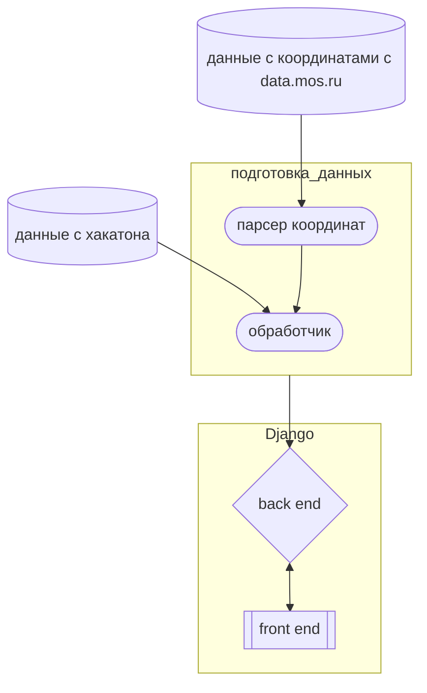

```mermaid
flowchart TB
	node1[(данные c хакатона)] --> snode1
	node2[(данные с координатами с data.mos.ru)] --> snode2
	
	subgraph подготовка_данных
	 snode2([парсер координат]) -->
	 snode1([обработчик])
	end
	
	подготовка_данных  --> node3{back end}
	subgraph Django	
	  node3 <--> node4[[front end]]
	end
```